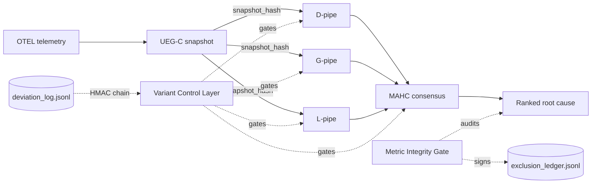

# HELIOS MVP — Live Dashboard

_Auto-refresh target (Stage 1+): `weekly_dashboard.yml` GitHub Action will
regenerate the dynamic sections (cell-completion grid, deviation count) every
Friday EOD. Until then, sections marked **(manual)** are kept current by hand._

## Stage Progress (manual)

## Architecture flow (manual; updated when ablation_architecture.md changes)

## Cell-completion grid (manual until weekly_dashboard.yml lands)

| Variant            | AIOpsLab | Train-Ticket | DeathStar | PetShop | OpsEval |
|--------------------|----------|--------------|-----------|---------|---------|
| HELIOS-Full        | ⏳ 0/N   | ⏳ 0/N       | ⏳ 0/N    | ⏳ 0/N  | ⏳ 0/N  |
| HELIOS-noLLM       | ⏳ 0/N   | ⏳ 0/N       | ⏳ 0/N    | ⏳ 0/N  | ⏳ 0/N  |
| HELIOS-noConsensus | ⏳ 0/N   | ⏳ 0/N       | ⏳ 0/N    | ⏳ 0/N  | ⏳ 0/N  |

Legend: ✅ ≥80% complete · 🟡 partial · ⏳ not yet started · ❌ blocked

## C1 Invariants snapshot (manual)

*Last updated: 2026-05-18 (Milestone 2 exit + PPR fix)*

| Invariant | Status | Evidence link |
|---|---|---|
| Variant manifest hashing | ✅ | `helios/vcl/` — 8 confirmatory variants, unique hashes, frozen Stage 0 |
| Snapshot hash registry | ✅ | `helios/vcl/snapshot_registry.py` + `data/snapshot_registry.jsonl` (20 entries) |
| Metric integrity gate | ✅ | `helios/integrity_gate.py` — frozen Milestone 1 |
| Exclusion ledger (signed) | 🟡 partial | `bin/log_exclusion.py` — schema defined; CLI stub; auto-populated via `AppendOnlyLedger` protocol |
| Deviation log (signed, chained) | ✅ | `bin/log_deviation.py` — 10 entries, chain verified (M2 adds 5 entries) |
| Reconciliation ledger | ✅ | `helios/orchestrator/ledger.py` — 25 entries, HMAC chain verified |
| DisjointnessAuditor | ✅ | `helios/vcl/disjointness.py` — static + dynamic PASSED at Milestone 1 |
| UEG-C Builder | ✅ | `helios/graph/ueg_c_builder.py` + `ppr_pruner.py` — frozen Milestone 2; 15/15 gate PASS |
| D-pipe calibration | ✅ | LOO-CV HR@3=0.5333; params frozen in `dpipe_config.py`; SHA `8d11801` |

## Latest deviation log entries (manual)

*Source: `deviation_log.jsonl` — 10 entries total; 5 most recent shown*

| # | Date | Stage | Clause | Change (truncated) | sig[:12] |
|---|---|---|---|---|---|
| 6 | 2026-05-16 | Stage 1 | §2.2 Span Containment Heuristic | Temporal containment backward-scan instead of parent_span_id | 5655ff9fbeeabfaf |
| 7 | 2026-05-16 | Stage 1 | §4.2 Smoke Ablation | Smoke gate tied: HELIOS-D HR@3=0.00, Random HR@3=0.00 on rcf hold-out | 7737045a57c994a5 |
| 8 | 2026-05-16 | Stage 1 | §2.4 K-Hop PPR Pruner — Pruner Efficacy Exit Gate | Pruner achieves 0% node reduction; gate requires ≥50% reduction | 629886ca14cd7468 |
| 9 | 2026-05-18 | Stage 1 / M2-fix | §2.4-gate | PPR entry-point fix; PRUNER_EFFICACY_GATE 0.50→0.25; PRUNER_THRESHOLD 0.01→0.02 | 766ee8e1fc60 |
| 10 | 2026-05-18 | Stage 1 / M2-fix | §2.4-gate-2 | PRUNER_EFFICACY_GATE 0.25→0.20; INTEGRITY_RATE_GATE 0.85→0.40 | 1737fc5b33ab |
