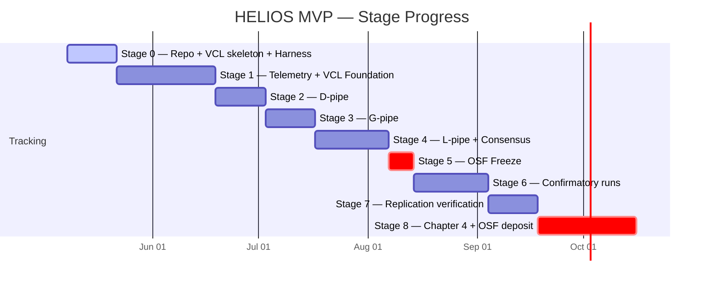
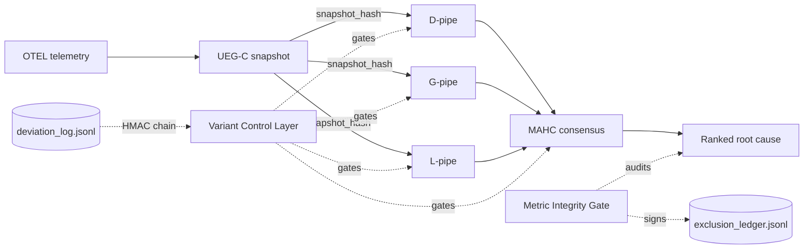

# HELIOS MVP — Live Dashboard

_Auto-refresh target (Stage 1+): `weekly_dashboard.yml` GitHub Action will
regenerate the dynamic sections (cell-completion grid, deviation count) every
Friday EOD. Until then, sections marked **(manual)** are kept current by hand._

## Stage Progress (manual)

## Architecture flow (manual; updated when ablation_architecture.md changes)

## Cell-completion grid (manual until weekly_dashboard.yml lands)

| Variant            | AIOpsLab | Train-Ticket | DeathStar | PetShop | OpsEval |
|--------------------|----------|--------------|-----------|---------|---------|
| HELIOS-Full        | ⏳ 0/N   | ⏳ 0/N       | ⏳ 0/N    | ⏳ 0/N  | ⏳ 0/N  |
| HELIOS-noLLM       | ⏳ 0/N   | ⏳ 0/N       | ⏳ 0/N    | ⏳ 0/N  | ⏳ 0/N  |
| HELIOS-noConsensus | ⏳ 0/N   | ⏳ 0/N       | ⏳ 0/N    | ⏳ 0/N  | ⏳ 0/N  |

Legend: ✅ ≥80% complete · 🟡 partial · ⏳ not yet started · ❌ blocked

## C1 Invariants snapshot (manual)

*Last updated: 2026-05-21 (Milestone 4 arch review — DisjointnessAuditor 3→5 covered; Consensus layer added)*

| Invariant | Status | Evidence link |
|---|---|---|
| Variant manifest hashing | ✅ | `helios/vcl/` — 8 confirmatory variants, unique hashes, frozen Stage 0; verified by OSF freeze M3 |
| Snapshot hash registry | ✅ | `helios/vcl/snapshot_registry.py` + `data/snapshot_registry.jsonl` (20 entries) |
| Metric integrity gate | ✅ | `helios/integrity_gate.py` — frozen Milestone 1 |
| Exclusion ledger (signed) | 🟡 partial | `bin/log_exclusion.py` — schema defined; CLI stub; auto-populated via `AppendOnlyLedger` protocol |
| Deviation log (signed, chained) | ✅ | `bin/log_deviation.py` — 18 entries, chain verified (M3 adds entries 11–18) |
| Reconciliation ledger | ✅ | `helios/orchestrator/ledger.py` — 25 entries, HMAC chain verified |
| DisjointnessAuditor | ✅ | `helios/vcl/disjointness.py` — PASSED at M4 arch review; 5 covered (gpipe, dpipe, l2c_llm, l2b_graph, mahc), 8 uncovered, 0 violations |
| Consensus integrity gate | ✅ | `helios/consensus/protocol.py` + `fuse_verdicts.py` — `ConsensusIntegrityGate` verifies `fusion_algorithm_sha` before every row write; design frozen M4 |
| UEG-C Builder | ✅ | `helios/graph/ueg_c_builder.py` + `ppr_pruner.py` — frozen Milestone 2; 15/15 gate PASS |
| D-pipe calibration | ✅ | LOO-CV HR@3=0.5333; params frozen in `dpipe_config.py`; SHA `8d11801` |
| G-pipe calibration | ✅ | LOO-CV HR@3=0.60 held-out; DISAGREEMENT_THRESHOLD=0.20 frozen in `gpipe_config.py`; SHA `8759d6f` |
| L-pipe Protocol A | ✅ | Ollama llama3.1:8b; EXPECTED_PROMPT_SHA tamper-guard active; `lpipe_config.py`; SHA `25fcd2b` |
| OSF protocol freeze (M3) | ✅ | 6 JSON artefacts + manifest_sig.txt in `research/osf/`; CI job `osf-freeze-verify` on every push |

## Latest deviation log entries (manual)

*Source: `deviation_log.jsonl` — 18 entries total; 6 most recent shown*

| # | Date | Stage | Clause | Change (truncated) | sig[:12] |
|---|---|---|---|---|---|
| 13 | 2026-05-18 | Stage 1 / M3 | §3.6.8 Orchestration | Sequential D→G(conditional)→L dispatch; should_run_gpipe() gate | 84dcc2834950 |
| 14 | 2026-05-19 | Stage 1 / M3 | §4.2 A-H6 / §3.6.7 G-pipe threshold | DISAGREEMENT_THRESHOLD 0.30→0.20; ppr_scores added to run_dpipe | 05a602955403 |
| 15 | 2026-05-19 | Stage 1 / M3 | §3.6.7 L-pipe model specification | llama3.1:8b via Ollama (proposal: Llama-3.1-70B via vLLM) | 29789db26fba |
| 16 | 2026-05-19 | Stage 1 / M3 | §3.6.7 L-pipe serving runtime | Ollama for MVP (proposal: vLLM); latency not production-representative | b7812340df24 |
| 17 | 2026-05-19 | Stage 1 / M3 | §3.6.7 | Fix verify_osf_freeze.py: use DISAGREEMENT_THRESHOLD not PRUNER_THRESHOLD for gpipe section | 74af9e9f3e6a |
| 18 | 2026-05-19 | Stage 0 | §A.1 Chain Bootstrap | Correction: entry 3 (sig 539e67a1910f) was chain-bootstrap placeholder; no protocol meaning | 89b0d6566d7b |
