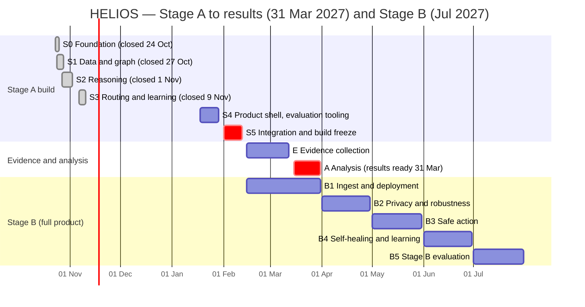
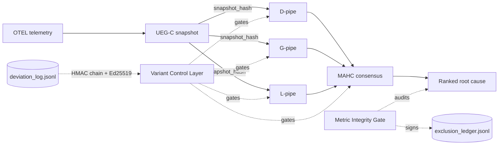

# HELIOS — Live Dashboard

_Manual until a weekly CI job regenerates the dynamic sections. Refreshed at every sprint exit (see `docs/sprints/README.md`)._

**Last updated:** 2026-11-09 (S3 exit documentation sync)

## Sprint progress (manual)

Plan: `docs/tracking/helios_e2e_product_plan_2026-10.md`; sprint plans and exit reports: `docs/sprints/`.

```mermaid
gantt
    title HELIOS — Stage A to results (31 Mar 2027) and Stage B (Jul 2027)
    dateFormat YYYY-MM-DD
    axisFormat %d %b

    section Stage A build
    S0 Foundation (closed 24 Oct)        :done, s0, 2026-10-23, 2d
    S1 Data and graph (closed 27 Oct)    :done, s1, 2026-10-24, 4d
    S2 Reasoning (closed 1 Nov)          :done, s2, 2026-10-27, 6d
    S3 Routing and learning (closed 9 Nov) :done, s3, 2026-11-06, 4d
    S4 Product shell, evaluation tooling :s4, 2027-01-18, 2027-01-29
    S5 Integration and build freeze      :crit, s5, 2027-02-01, 2027-02-12

    section Evidence and analysis
    E Evidence collection                :e, 2027-02-15, 2027-03-12
    A Analysis (results ready 31 Mar)    :crit, a, 2027-03-15, 2027-03-31

    section Stage B (full product)
    B1 Ingest and deployment             :b1, 2027-02-15, 2027-03-31
    B2 Privacy and robustness            :b2, 2027-04-01, 2027-04-30
    B3 Safe action                       :b3, 2027-05-01, 2027-05-31
    B4 Self-healing and learning         :b4, 2027-06-01, 2027-06-30
    B5 Stage B evaluation                :b5, 2027-07-01, 2027-07-31
```

| Sprint | Status | Exit |
|---|---|---|
| S0 Foundation | Closed 2026-10-24 | `rb-s0-exit`; [exit report](../sprints/s0-foundation/exit_report.md) |
| S1 Data and graph | Closed 2026-10-27 (started early, 2026-10-24) | `rb-s1-exit`; [exit report](../sprints/s1-data-graph/exit_report.md) |
| S2 Reasoning, consensus, narratives | Closed 2026-11-01 (started early, 2026-10-27); S2.9 rater training scheduled before S5 | `rb-s2-exit`; [exit report](../sprints/s2-reasoning/exit_report.md) |
| S3 Routing and learning | Closed 2026-11-09 (started early, 2026-11-06); S3.4 moved to Stage B | `rb-s3-exit`; [exit report](../sprints/s3-routing/exit_report.md) |
| S4 Product shell, evaluation tooling | Next (plan refresh before it starts) | — |

## Architecture flow (manual; updated when ablation_architecture.md changes)

```mermaid
flowchart LR
    OTEL[OTEL telemetry] --> UEG[UEG-C snapshot]
    UEG -->|snapshot_hash| D[D-pipe]
    UEG -->|snapshot_hash| G[G-pipe]
    UEG -->|snapshot_hash| L[L-pipe]
    D --> C[MAHC consensus]
    G --> C
    L --> C
    C --> R[Ranked root cause]
    VCL[Variant Control Layer] -.gates.-> D
    VCL -.gates.-> G
    VCL -.gates.-> L
    VCL -.gates.-> C
    MIG[Metric Integrity Gate] -.audits.-> R
    MIG -.signs.-> EL[(exclusion_ledger.jsonl)]
    DL[(deviation_log.jsonl)] -.HMAC chain + Ed25519.-> VCL
```

## Evidence grid (phase E; empty until 15 Feb 2027)

Confirmatory pool: 240 RCAEval cases (RE2-OB, RE2-TT, RE3-OB, RE3-TT), sealed in S1.1. Each cell counts cases run or formally excluded; a cell enters inference only with at least 80% of its cases.

| System | RE2-OB | RE2-TT | RE3-OB | RE3-TT |
|---|---|---|---|---|
| 8 confirmatory variants (Family A) | ⏳ | ⏳ | ⏳ | ⏳ |
| 5 baselines B1–B5 (Family B) | ⏳ | ⏳ | ⏳ | ⏳ |
| Exploratory variants (Family E) | ⏳ | ⏳ | ⏳ | ⏳ |

Legend: ✅ ≥80% complete · 🟡 partial · ⏳ not yet started · ❌ blocked

## Integrity snapshot (manual)

| Invariant | Status | Evidence (as of 2026-11-01 unless stated) |
|---|---|---|
| Deviation log (HMAC chain + Ed25519) | ✅ | 83 entries (2026-11-09); `verify-public` passes with the public key only; entries 35–83 Ed25519-signed |
| Chain-of-Evidence ledgers (S2.7) | ✅ | One signed file per orchestrator run (HMAC per entry, Ed25519 anchor); `verify_ledgers.py --coe DIR [--public-only]`; build ledgers for rater training verify (1,116 entries) |
| Annotations ledger (S2.9) | ✅ (no labels yet) | Own HMAC secret and Ed25519 key (`.env.labelling`); `verify_ledgers.py --annotations DIR`; the labelling server refuses deviation secrets |
| Reconciliation ledger | ✅ | 25 entries; chain and anchor verified |
| Exclusion ledger | ✅ (empty) | Anchor present; populated from phase E |
| Capture content seals | ✅ | 20 exploratory OTel captures (`verify_captures.py`); RCAEval 240 pool + 495 build sealed (S1.1); 63 OTel build cases (`capture_campaign.py verify`, S1.2) |
| VCL variants | ✅ | 15 variants (8 confirmatory, 7 exploratory), unique hashes; confirmatory hashes identical to OSF deposit 1 (`vcl_manifest_tracking.md`) |
| OSF freeze | ✅ | Deposit 1, DOI 10.17605/OSF.IO/KMR3D; `verify_osf_freeze.py --verify` passes |
| Seed register | ✅ | 10,000,000–10,009,999, layout hash pinned (`seed_register.md`) |
| Tracker schema | ✅ | Validator in pre-commit and CI over every commit (`--range`) |
| Label leakage | ✅ | Opaque IDs (S1.1); `tests/evaluation/test_no_ground_truth_leak.py` scans the run path and traps label reads at run time (S1.9) |
| DisjointnessAuditor | 🟡 | As of M4 (2026-05-21): 5 flags covered, 0 violations; re-certified for all 16 boolean flags in S5.2 |
| Snapshot hash registry | ✅ (empty) | `data/snapshot_registry.jsonl` was reset on purpose when the 20 incidents were re-captured (commit `b24955c`, May 2026); runs recreate it (`bin/helios_run.py` default path). Checked in S1.1 |

## Latest deviation log entries (manual)

*Source: `deviation_log.jsonl` — 83 entries; 6 most recent shown. Full text: `deviation_log.md`.*

| # | Date | Change (short) | sig[:12] |
|---|---|---|---|
| 78 | 2026-11-08 | OTel fix: G-pipe reselection on the candidate chain | `36b07fa335b2` |
| 79 | 2026-11-08 | OTel fix: MAHC run 4 on the candidate chain | `f6de3055c6aa` |
| 80 | 2026-11-08 | OTel fix: router run 3 on the candidate chain | `244dbfd4a768` |
| 81 | 2026-11-08 | OTel v4 validation: tie (30/36), old chain kept | `b48d6289089a` |
| 82 | 2026-11-08 | S3.2 ACP pre-run (four remediation families, recorded not routed); S3.4 to Stage B | `5f2b5cc697eb` |
| 83 | 2026-11-08 | ACP fitted once and frozen (`dd7b63d3`) | `cd5f12ab2d12` |
